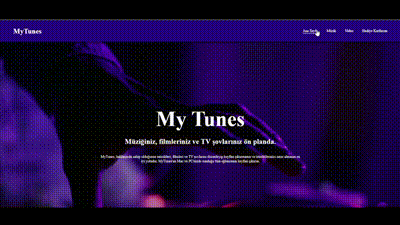

<h1> MyTunes Project </h1>

My Tunes is a platform that brings you closer to the magic of music, offering a unique web experience. With its modern design and user-friendly interface, My Tunes is specially crafted for music enthusiasts.

My Tunes boasts a responsive design that seamlessly adapts to every device. Whether on your computer, tablet, or even your smartphone, you can access My Tunes on any platform and enjoy your music wherever you go.

My Tunes invites you to explore the universal language of music. Discover songs that resonate with every moment, immerse yourself in the joy of music, and share your musical journey with the My Tunes community. Welcome to My Tunes – are you ready to explore the passion for music together?

<h2> The technologies used in the project </h2>

It was coded using HTML5 and CSS3 technologies. Also used Bootstrap Icons and Google Fonts.

<h2> Screenshot </h2>

